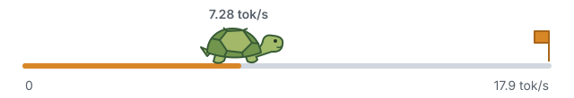

<h1 align="center">unremarkable</h1>

<p align="center">
  
</p>

A tiny LLM running entirely on a reMarkable 2.

An inference engine written in C++23, built to learn how to make language models
run faster on limited hardware.
Loads weights into RAM and implements the forward pass, tokenizer, and sampling.
Runs TinyStories 15M and SmolLM2-135M-Instruct, with optional tablet UI patches.

## Try it locally

Requires Linux or macOS, a C++23 compiler, Make, Python 3.11+, and curl.

```sh
make
make models  # downloads TinyStories 15M (~62 MB with tokenizer)
./build/unremarkable models/stories15M.bin -z models/tokenizer.bin -i "Once upon a time"
```

## Ceiling

SmolLM2-135M Q8: **5.88 tok/s**, about **33%** of the estimated memory ceiling.



We measured **2.708 GB/s** of sequential reads using both cores over a 144 MiB buffer,
larger than the CPU cache. Each generated token reads roughly **151 MB** of Q8 weights,
including quantization scales: **2.708 GB/s ÷ 0.151 GB/token ≈ 17.9 tok/s**.
This assumes all that bandwidth goes to weights; compute, KV-cache traffic, and
thread coordination reduce achievable speed. [Measurements and assumptions](docs/performance.md#memory-roofline-2026-09-10).

| Checkpoint | Decode tok/s |
| --- | ---: |
| FP32 baseline | 1.08 |
| NEON alone (slightly slower) | 1.03 |
| NEON + prefetch | 1.74 |
| Q8 quantization | 3.83 |
| Q8 on both cores | **5.88** |

## Docs

- [Usage](docs/usage.md): SmolLM2, sampling, context, and output.
- [Tablet setup](docs/tablet.md): cross-compilation, deployment, and UI patches.
- [Performance](docs/performance.md): measurements and the [raw numbers](docs/benchmarks.csv).
- [Development](docs/development.md): code layout, forward pass, and checks.

Adapted from [llama2.c](THIRD_PARTY.md).
